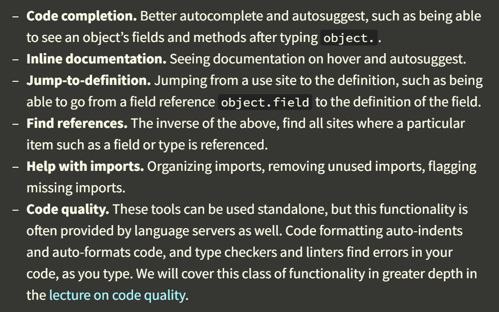

# Lecture 3: Development Environment and Tools [![Missing_Semester][MS_ICON_M]](https://missing.csail.mit.edu/2026/development-environment/)

*Development environment is a set of tools for developing software.*

You can classify development environments into **terminal-based** and **integrated** (IDE). "integrated" means "everything in one place".  

VS Code is an IDE. Cursor and Kiro are forks of VS Code.

Vim (text-editor) is a part of terminal-based development workflows. To develop in terminal, we usually need a terminal multiplexer (e.g. `tmux`), a text editor (e.g. `vim`), a shell (e.g. `bash`), and several language-specific command-line tools.

---

Part I: [Text editing and Vim](#text-editing-and-vim)

Part II: [Code intelligence and language servers](#code-intelligence-and-language-servers)

Part III: [AI-powered development](#ai-powered-development)

Part IV: [Extensions and other IDE functionality](#extensions-and-other-ide-functionality)

## Text editing and Vim

When writing codes. We often need to jump from one file or snippet to another. Vim is optimized for this case.

Moreover, switching between keyboard and mouse is slow. I'd be much faster if we could keep our hands on keyboard. Vim supports this.

Vim is so powerful that even if in some non-vim softwares, vim mode key bindings are supported. e.g. VS Code, Zsh, Bash, Claude Code.

### How to use Vim

Some features are supported only by Neovim but Vim. And Neovim even support mouse click. So, please use Neovim.

Here are some examples of vim key bindings (only a tiny part). Just to illustrate how differently vim behaves compared to text editors like MS Word.

Please check [![missing_semester][MS_ICON]](https://missing.csail.mit.edu/2026/development-environment/#modal-editing) and [![nvim][NVIM_ICON]](https://neovim.io/doc/user/) for more vim instruction.  
Cheat sheet: [Vim cheat sheet](https://vim.rtorr.com/)

- `j` / `k`: move cursor down / up.  
  `10j`: move the cursor down by 10 lines.
- `f`: find one character on the current line (`/`: search regex).  
  `f]`: find next `]` -> press `%`: jump to the matching `[`.
- `ci`: change inside.  
  `ci(`: change text in next `()`.  
  `ci[`: change text in next `[]`.

### Model editing

You can switch between different modes.

#### In Normal mode

- `i`: Insert mode
- `R`: Replace mode
- `v`: Visual plain mode
- `V`: Visual line mode
- `Ctrl v` or `Ctrl-q`: Visual block mode
- `:`: Command-line mode

#### In any other mode

- `Esc`: Normal mode

### Use vim interface as a programming language

We will focus on **Normal mode** in this section.

#### Movement

- `h`, `j`, `k`, `l` or `↑`, `↓`, `→`, `←`: move around.
- `w`: move to the beginning of next word.  
  `b`: move to the beginning of the current / last word.
  `e`: move to the end of the word current / next word.
- `0`: go to the beginning of the line.  
  `$`: go to the end of the line.
- `H`, `M`, `L`: go to the top (head), middle, bottom (last) of screen.
- `Ctrl-d` / `Ctrl-u`: scroll down / up.
- `gg` / `G`: go to the beginning / end of the file.
- [In command mode] `:123`: go to the 123rd line.
- `%`: find the matching item (like braces).
- `f{char}`: find a character forward on the current line.  
  `t{char}`: find a character backward on the current line.  
  `;` / `,`: move to next / last result.
- `\{regex}`: search in the file.  
  Press `Enter` to confirm. Then press `n` or `N` to go to the next or previous result.

#### Selection

Move in Visual mode to select.

- `v`: Visual (plain) mode
- `V`: Visual line mode
- `Ctrl-v` or `Ctrl-q`: Visual block mode  
  
In windows terminal, `Ctrl-v` might not trigger Visual Block mode. Because windows may replace `Ctrl-v` with paste for you.

#### Edits

In Normal mode:

- `i`: enter Insert mode.
- `o` / `O`: create a new line below / above and then enter Insert mode.
- `c{movement}`: change.
- `d{movement}`: delete.
- `x`: delete character (equivalent to `dl`).
- `s`: substitute character (=`cl`).
- Select text in Visual mode, then press `d` or `c` to delete or modify.
- **`u`: undo.**
- **`y`: copy ("yank").**
- **`p`: paste.**

There are many other to learn.

#### Counts

You can combine nouns (movements) and verbs (edits) with a count.

- `3j`: move down 3 lines (do `j` 3 times).
- `10dw`: delete next 10 words (do `dw` 10 times).
- `5u`: undo 5 times.

#### Modifiers

- `i`: inside / inner
- `a`: around

For example: *`ci(`: change the contents inside the current pair of parentheses; `ci[`: change the contents inside the current pair of square brackets; `da'`: delete a single-quoted string, including the surrounding single quotes*

#### Practice

Fix this broken python code with vim.

```python
def fizz_buzz(limit):
    for i in range(limit):
        if i % 3 == 0:
            print("fizz", end="")
        if i % 5 == 0:
            print("fizz", end="")
        if i % 3 and i % 5:
            print(i, end="")
        print()

def main():
    fizz_buzz(20)
```

Use `vimtutor` or play [vim adventures](https://vim-adventures.com/) to improve your vim skills.

## Code intelligence and language servers

Language-specific support in an IDE is achieved by communicating with language server (who provide language-specific support) through Language Server Protocol (LSP).

*By installing the extension and language server for the languages you work with, you can enable many language-specific features in your IDE, such as:*  


## AI-powered development

There are 3 main ways for people to use AI tools helping them write codes.

- [Autocomplete](#autocomplete)
- [Inline chat](#inline-chat)
- [Coding agents](#coding-agents)

Privacy issues: ummm.... [![47:16][YT_ICON]](https://youtu.be/QnM1nVzrkx8?t=2836)

These tools are continuously evolving. So, please pay attention to that.

### Autocomplete

You can passively accept AI's suggestions or steer it by writing comments.

Autocomplete has limited scope.

In VS Code, press `Tab` to accept AI's suggestions.

### Inline chat

In VS Code, you can select the text first and then press `Ctrl-i` to trigger AI in inline-chat mode.

Inline chat can only modify selected section.

### Coding agents

Will be covered in [Lecture 7: Agentic coding](https://missing.csail.mit.edu/2026/agentic-coding/).

### Recommended software

- GitHub Copilot in VS Code (free for students and teachers)
- Cursor (a VS Code fork)

## Extensions and other IDE functionality

[YT_ICON]: https://img.shields.io/badge/YouTube-%23FF0000.svg?style=flat-square&logo=YouTube&logoColor=white

[NVIM_ICON]: https://img.shields.io/badge/Neovim-%57A143.svg?style=flat&logo=neovim&logoColor=white

[MS_ICON]: https://missing.csail.mit.edu/static/assets/favicon-16x16.png

[MS_ICON_M]: https://missing.csail.mit.edu/static/assets/favicon-32x32.png
