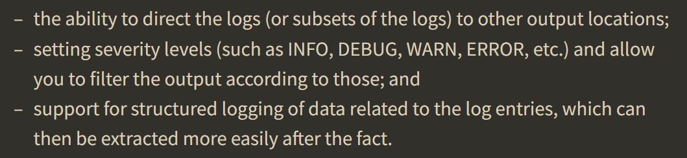
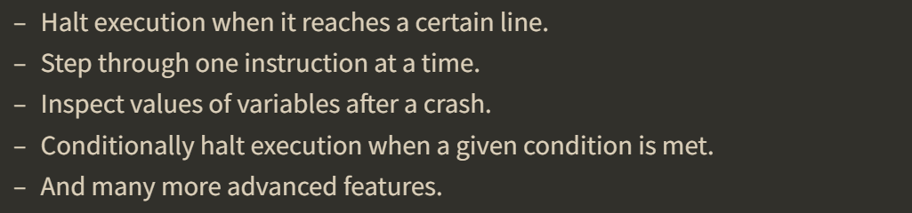
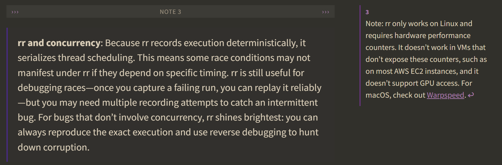

# Lecture 1: Lecture 4: Debugging and Profiling [![missing semester][ms32]](https://missing.csail.mit.edu/2026/debugging-profiling/)

## Debugging

### Printf Debugging and Logging

"*The most effective debugging tool is still careful thought coupled with judicially placed print statements.*"

Besides print statement, logging is another approach to debug.  *Logging is essentially “printing with more care”.*  Logging framework usually has the following abilities [![logging][ms16]](https://missing.csail.mit.edu/2026/debugging-profiling/#debugging):



There are structured (e.g. JSON) and unstructured (printing out texts saying what the program is doing) logs.  

Logging levels (like trace, debug, info, warn, error, critical, ...) are used to differentiate the severity of loggings.  You can filter logging based on level, for example, in production environment, you may turn off trace and debug logging. While when you are debugging, you may want to keep the debug logs.  (When we are writing codes, if we think that some information needs to be logged, use log instead of print statements so that we don't have re-compile this part in the end).

*[![logging][ms16]](https://missing.csail.mit.edu/2026/debugging-profiling/#debugging) And indeed, once you’ve found and fixed a problem using print statements, it’s often worthwhile to convert those prints into proper log statements before removing them. This way, if similar bugs occur in the future, you’ll already have the diagnostic information you need without modifying the code.*

A lot of third-party applications have logging built in.  The question is just to figure out how to access it—most command-line cools have `-v` or `--verbose` to give you more information. Some even allows you to use `-v -v` or `-vv` to give more verbose output.  For system services, use `journalctl` tool to access the logs.

### Debuggers

Usually, it's time-consuming to re-compile or re-deploy each time, or you don't know what to log. This is when **debuggers** come to help.  The most common debuggers are `gdb` and `lldb`. They can be used in any program, but are used more often on compiled (binary) programs like those written in C/C++/Rust/...  For those written in interpretation languages like Python, people prefer to use language-specific debuggers like pdb for Python.

Debuggers enable you to [![debuggers][ms16]](https://missing.csail.mit.edu/2026/debugging-profiling/#debugging):



#### Record-Replay Debugging and Heisenbugs

Reverse debugging. `rr` (record replay) has exactly the same interface as `gdb`, but it can record everything the program does.  *So that the program can be executed in reverse order.* [![record replay debugging][yt]](https://youtu.be/8VYT9TcUmKs?t=478)

Heisenbugs refers to bugs that when you try to observe them, they are not there. Obviously, it's "name after" Heisenberg, one of the founders of Quantum Mechanics. You'll most commonly run into it when you are doing print debugging. Because print debugging will slow down your program—the program will stop and print something on screen. It is this small delay that causes the program behave differently, especially for concurrent programs.

Debuggers may run into this problem because they slow the program down.  However, `rr` solves this problem.

#### An example of `rr`

Here is an example of `rr` [![corruption.c, an example of rr][yt]](https://youtu.be/8VYT9TcUmKs?t=695)

```bash
# Record a program execution
rr record ./my_program

# Replay the recording (opens GDB)
rr replay
```

Other useful commands [![record replay][ms16]](https://missing.csail.mit.edu/2026/debugging-profiling/#record-replay-debugging):

- reverse-continue (`rc`) - Run backwards until hitting a breakpoint
- reverse-step (`rs`) - Step backwards one line
- reverse-next (`rn`) - Step backwards, skipping function calls
- reverse-finish - Run backwards until entering the current function

#### Pros and cons of `rr`

Pros: It would be very useful if you combine `rr` with bash scripts (for example, while loops).

Con: `rr` doesn't work very well in virtual machines, because it needs hardware support.  If you modify your code, you need to re-compile and re-record.

Use `rr` when [![record replay][ms16]](https://missing.csail.mit.edu/2026/debugging-profiling/#record-replay-debugging):

- Flaky tests that fail intermittently
- Race conditions and threading bugs
- Crashes that are hard to reproduce
- Any bug where you wish you could “go back in time”

#### Note



### System Call Tracing

Tracing makes it possible to observe what system calls is doing (including opening files, allocating memory, creating processes, etc.).

#### `strace` (Linux) and `dtruss` (macOS)

The most commonly used tracing tools are `strace` (Linux) and `dtruss` (macOS). For example, `strace ls -l` will record system calls made by `ls -l`. [![strace example][yt]](https://youtu.be/8VYT9TcUmKs?t=1538)

`strace` will record only system calls. You can filter which kind of system calls to show. For example, `-e%file` will show only file operations (check the manual page of `strace` for more information).

If one program calls another program, `strace` will not record system calls called by the child program. But with `-f` or `--follow-forks`, it will trace all system calls including those called by child programs.

##### Usage of `strace`

```bash
# Trace all system calls
strace ./my_program

# Trace only file-related calls
strace -e trace=file ./my_program

# Follow child processes (important for programs that start other programs)
strace -f ./my_program

# Trace a running process
strace -p <PID>

# Show timing information
strace -T ./my_program
```

#### `bpftrace` and `eBPF`

*`eBPF` (extended Berkeley Packet Filter) is a powerful Linux technology that allows running sandboxed programs in the kernel. `bpftrace` provides a high-level syntax for writing eBPF programs.* They are used to investigate the usage of system calls. [![example of bpftrace][yt]](https://youtu.be/8VYT9TcUmKs?t=2203)

#### Network Debugging

Use `tcpdump` and `Wireshark`.

### Memory Debugging

*Memory bugs—buffer overflows, use-after-free, memory leaks—are among the most dangerous and difficult to debug. They often don’t crash immediately but corrupt memory in ways that cause problems much later.* [![memory debugging][ms16]](https://missing.csail.mit.edu/2026/debugging-profiling/#memory-debugging)

#### Sanitizers

Sanitizers are like extensions to your compiler which make your compiler do sanity check to your program to prevent bad things.

An example of address sanitizer (`-fsanitizer=address`)—heap overflow. [![example of address sanitizer][yt]](https://youtu.be/8VYT9TcUmKs?t=2849)

```bash
# Compile with AddressSanitizer
gcc -fsanitize=address -g program.c -o program
./program
```

Some useful sanitizer [![sanitizers][ms16]](https://missing.csail.mit.edu/2026/debugging-profiling/#sanitizers):

- **ThreadSanitizer (TSan)**: Detects data races in multithreaded code (`-fsanitize=thread`)
- **MemorySanitizer (MSan)**: Detects reads of uninitialized memory (`-fsanitize=memory`)
- **UndefinedBehaviorSanitizer (UBSan)**: Detects undefined behavior like integer overflow (`-fsanitize=undefined`)

#### Valgrind

`valgrind` is an extensible program interpreter. It pretends to be a CPU (so, it runs program slower than running at normal CPU). It takes and execute your program and it can check very memory manipulations that your program does.

It also gives people instruction-level information. For example, it can tell you how many cycles are taken to execute this function.

To check memory leak: `valgrind --leak-check=full ./my_program`.

You can use valgrind **even if you don't have source code.**

### AI for Debugging

*AI can be an extremely useful tool for a certain subset of debugging.* [![AI for debugging][ms16]](https://missing.csail.mit.edu/2026/debugging-profiling/#ai-for-debugging)

AI can translate compiler's error messages to you.

LLMs might not good at fixing bugs, but they are really good at finding them. And it's efficient to let LLMs figuring what's going on in codes that are unfamiliar to you.

Please note that LLMs *work best as a complement to, not replacement for, understanding your code*.

## Profiling

Profiling is relevant to debugging.

*Algorithms classes often teach big O notation but not how to find hot spots in your programs. Since premature optimization is the root of all evil, you should learn about profilers and monitoring tools. They will help you understand which parts of your program are taking most of the time and/or resources so you can focus on optimizing those parts.* [![profiling][ms16]](https://missing.csail.mit.edu/2026/debugging-profiling/#profiling)

### Timing

#### Timing - `time`

There is a tool called `time`, which will tell you how much time a command takes. For example,

```bash
$ time curl https://missing.csail.mit.edu &> /dev/null

real    0m0.822s
user    0m0.025s
sys     0m0.027s
# Please note that user and sys time are CPU time, not real-world time
# For example, 10 CPUs runs the program for 1 ms (real time), then sys time should be 10 ms (CPU time)
# Running this program only takes 25+27 = 52ms CPU time, the rest time is waiting for response
```

`time` is one of the easiest ways to profile two programs. But it's not that reliable. Because the results will vary between executions.

#### Timing - `hyperfine`

You can give it multiple commands and it will run them multiple times and give you timing information.

For example:

```bash
# The following instruction compares the time consuming between
# [find . -name "*.md"]   and   [fd -e md]

$ hyperfine --warmup 3 'find . -name "*.md"' 'fd -e md'
Benchmark 1: find . -name "*.md"
  Time (mean ± σ):     731.7 ms ±  24.3 ms    [User: 176.0 ms, System: 482.4 ms]
  Range (min … max):   706.8 ms … 762.8 ms    10 runs

Benchmark 2: fd -e md
  Time (mean ± σ):      54.5 ms ±   2.9 ms    [User: 226.9 ms, System: 405.8 ms]
  Range (min … max):    48.8 ms …  61.3 ms    54 runs

Summary
  fd -e md ran
   13.43 ± 0.85 times faster than find . -name "*.md"

# Usually, fd is faster than find
```

### Resource Monitoring

- **General Monitoring**: `htop` is an improved version of `top`. `btop` is an even better version of `htop`.
- **I/O Operations**: `iotop` gives you information about input and output.
- **Memory Usage**: `free` gives you information about memory usage.
- **Open Files**: `lsof` gives you information about which process opens which file.
- **Network Connections**: `ss` gives you information about network connections. e.g. `ss -tlnp | grep :8080`.
- **Network Usage**: `nethogs` and `iftop` monitors each program uses how much network.

### CPU Profilers

When people talk about profilers, they are talking about CPU profilers.

There are two types of CPU profilers: [![cpu profilers][ms16]](https://missing.csail.mit.edu/2026/debugging-profiling/#cpu-profilers)

- **Tracing profilers** keep a record of every function call your program makes
- **Sampling profilers** probe your program periodically (commonly every millisecond) and record the program’s stack

#### perf: the sampling profiler

`perf` can tell you the which part of the program is spending the most time. Usage: `perf record -g ./my-program` (record what's going on in this program) + `perf record` (show the record). Or `perf stat ./my_program`, *it gives a quick overview of where time is spent*.

`perf record` is hard to read and parse. `flamegraph` (`inferno-flamegraph` is the rust version of `flamegraph`) can help you with that. It will parse the `perf record` and generate a `.svg` graph to show which function takes most time. Usage: `perf script | inferno-collapse-perf | inferno-flamegraph > slow.svg` + `imv slow.svg`.

#### Valgrind’s Callgrind: the tracing profiler

`perf` gives imperfect information because what it does is that it pauses the CPU frequently to see which part of the program is using the CPU currently. Although you can increase the sampling frequency to get more accurate results, the report cannot be 100% accurate. To get total details of your program, use **Valgrind's callgrind tool** (it doesn't sample, it track each instruction).  But one thing is for sure, the more accurate result you need. the more time it takes.

```bash
# Run with callgrind
valgrind --tool=callgrind ./my_program

# Analyze with callgrind_annotate (text) or kcachegrind (GUI)
callgrind_annotate callgrind.out.<pid>
kcachegrind callgrind.out.<pid>

# It can simulate cache behavior with flag --cache-sim=yes
```

### Visualizing Performance Data

To visualize how time increase with the scale of input, people invented some tools. [![visualizing performance data][ms16]](https://missing.csail.mit.edu/2026/debugging-profiling/#visualizing-performance-data)

- Gathering data with logging
- Plot with `gnuplot`, `matplotlib` (Python), or `ggplot2` (R)

## Topics Not Covered in the Lecture but on Handout

- **Memory Profilers**: use `massif`. [![memory profilers][ms16]](https://missing.csail.mit.edu/2026/debugging-profiling/#memory-profilers)
- **Benchmarking**: use `hyperfine` (mentioned in [timing](#timing---hyperfine)). [![benchmarking][ms16]](https://missing.csail.mit.edu/2026/debugging-profiling/#benchmarking)

## In the End

Think about what you want to log and how you log early on.

## Tips

- `Ctrl + L` will clear the screen.

[yt]: https://img.shields.io/badge/YouTube-%23FF0000.svg?style=flat-square&logo=YouTube&logoColor=white
[ms16]: https://missing.csail.mit.edu/static/assets/favicon-16x16.png
[ms32]: https://missing.csail.mit.edu/static/assets/favicon-32x32.png
